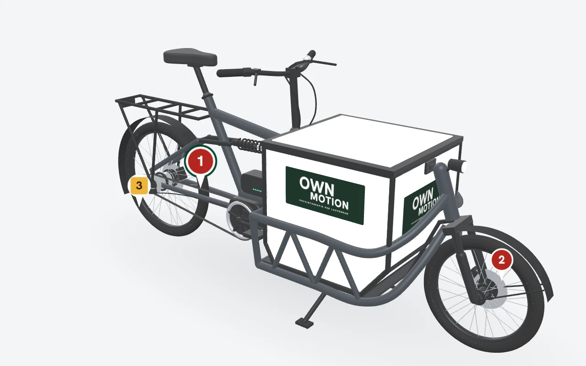
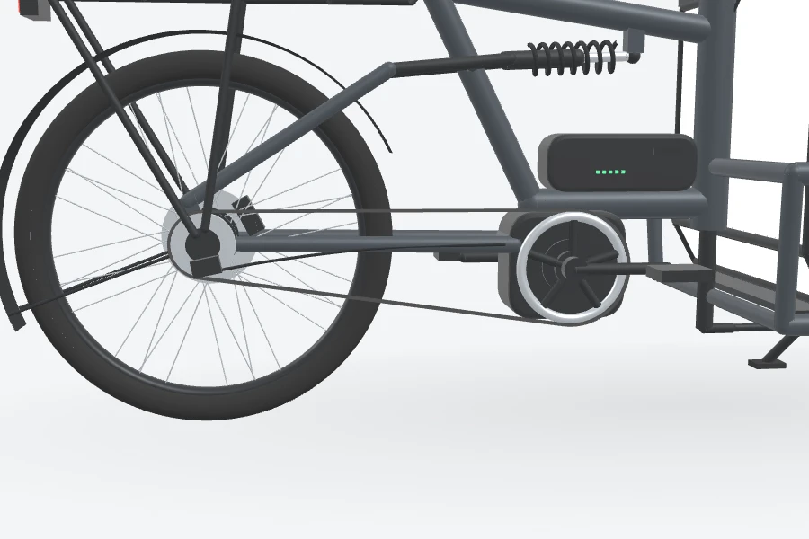
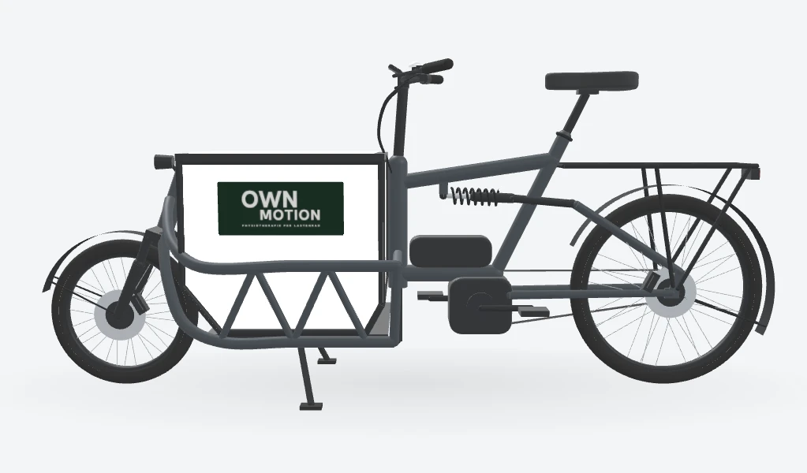
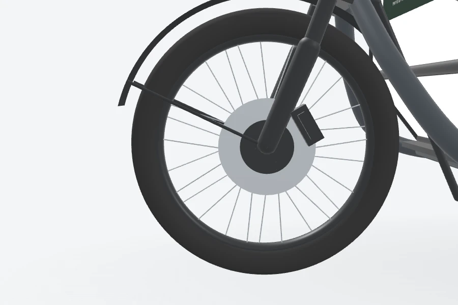

# Handoff: Lastenrad als 3D-Modell · Stellen markieren in Check-Up und Panne, Stellen am Rad, PDF für die Werkstatt

> **Entwurfsreferenz für FLT-EPIC-001, kein Produktionscode.** Die Entwürfe liegen auf der
> Design-Leinwand „Lastenrad-Checkup 3D“ (privat bei Jannes,
> `https://claude.ai/artifact/4miXXiCdCkaC99mSJbK58Z`) und als byte-gleiche Kopie unter
> [`lastenrad-3d/kanvas/`](lastenrad-3d/kanvas/). Gebaut wird **nicht vorab**, sondern im Loop
> **FLT-EPIC-001** an seiner Stelle in der Roadmap (Block 8), der die Vorschau der Radflotte ersetzt
> (Entscheidung Jannes, 08.10.2026). Dieses Dokument legt Oberfläche, Verhalten und das Modell fest;
> Datenmodell, Rollen, Fristen und Dateiablage entscheidet der Loop nach den ADRs.

Stand 08.10.2026. Ergänzt die Handoffs vom 01.10. bis 06.10.2026 und ersetzt nichts daraus.

## 0 · Entscheidungen von Jannes

Aus dem Gespräch vom 07. und 08.10.2026 zur Leinwand:

- **Auftrag:** Ein 3D-Modell des Lastenrads mit Transportbox, Logo und Designsystem von Own Motion
  dient dazu, **Defekte am Rad zu markieren**. Der Check-Up-Fragebogen enthält das Rad.
- **Bauart:** zunächst Riese & Müller **Load 60 mit Riemenantrieb** (im Modell mit Nabenschaltung).
  Es wird später verschiedene Räder geben.
- **Bauteile:** Transportbox, Speichen und Ständer sind als eigene Bauteile markierbar.
- **Fotos:** „wie du empfiehlst“ – Fotos hängen an der markierten Stelle; für alles andere gibt es
  „Weitere Fotos“.
- **Weitere Orte:** das 3D-Rad auch im **Pannenassistenten** und im **Verlauf des Rads**.
- **Werkstatt:** bekommt eine **PDF als Übersicht**; sie arbeitet nicht in der App.
- **Umsetzung:** an der richtigen Stelle, also in FLT-EPIC-001, nicht vorgezogen.

Damit gilt die Abgrenzung aus `IDEA-PRX-048` („gehört nicht in die Praxissoftware“) nicht mehr für das
Rad als **Werkzeug**; für das Rad als Schmuck und Website-Objekt bleibt sie (`IDEA-PRX-057`). Dasselbe
gilt für die Regel des Designsystems, das Rad in der Praxissoftware nur als Foto zu zeigen. Neben der
Wortmarke steht das Rad nie (`marke/README.md`, Verbote).

## 1 · Vorschläge aus dem Entwurf

Von Claude im Entwurf gesetzt, **von Jannes nicht ausdrücklich entschieden**. Der Loop trifft sie als
Annahme (`ANN-NNN`, §15.1) oder verwirft sie:

1. **Eigene Seite je Rad** („Stellen am Rad“) statt eines weiteren Aufklappers in der Radkarte; die
   Radkarte bekommt einen Weg dorthin. Grund: Das 3D-Rad braucht Platz, die Liste aller Räder bleibt
   leicht. Jannes hat die Erklärung am 08.10. erhalten und nicht widersprochen.
2. **Stellen gelten mit „Freigeben“ als erledigt** und bleiben im Verlauf. Die Werkstatt hakt nur
   auf Papier ab (Spalte „Erledigt“ der PDF).
3. **Die markierte Stelle hebt die Bewertung ihres Prüfpunkts an, nie ab** (eine Stelle „Problem“ an
   der Bremse setzt „Bremsen“ auf „Problem“).
4. **Zwei Einstufungen** an der Stelle: „Problem“ und „Beobachten“. In der Pannenmeldung gibt es
   keine Einstufung; jede Stelle ist dort ein Schaden.
5. **Die PDF enthält nur Angaben zum Rad:** keine Namen aus dem Team, keine Termine, kein Ort der
   Panne. Notizen und Fotos gehen unverändert mit; die Meldung nach dem Erstellen bittet, sie vor dem
   Weitergeben auf Patientendaten zu prüfen.
6. **Die Anwendung versendet die PDF nicht.** Sie entsteht über die Druckansicht des Browsers wie das
   Rechnungsblatt (B14, Weg 1) und wird von Hand verschickt. Ein Versand aus der Anwendung wäre nach
   ADR-017 Punkt 42 nicht freigegeben und bräuchte einen Mail-Anbieter (B13).
7. **Empfänger und Rückfragen:** „An“ ist der Name der Vertragswerkstatt aus der Standortvorlage
   (`werkstatt.name`), „Rückfragen“ die zuständige Rolle aus der Vorlage (Teamleitung) mit
   `hallo@ownmotion.de`, dem Kontakt auf Drucksachen aus `marke/README.md`.
8. **Text der Köln-Vorlage:** „Kettenriss“ im Pannenablauf hängt künftig an der Antriebsart; beim
   Load 60 mit Riemen heißt es „Riemenriss“.

## 2 · Geltung

**Ersetzt in FLT-EPIC-001** (ersetzt, nicht daneben gebaut): den Fahrrad-Check-Up
(`/betrieb/flotte/checkup`), den Pannenassistenten (`/betrieb/flotte/panne`) und die Verläufe für
Panne und Check-Up an der Radkarte in `/betrieb/flotte`.

**Unverändert bleiben:** die Schrittstruktur des Pannenassistenten (`src/features/fleet/pannenablauf.ts`;
der neue Schritt kommt davor), die Standortinhalte aus `src/features/preview/standortvorlage.ts`,
Tokens und Bausteine aus `src/index.css` und `src/components/ui`, die Marke nach `marke/README.md`.

**Kein Scope:** Rad im Kalender (eigener Loop nach Roadmap), weitere Bauarten über das Load 60 mit
Riemen hinaus (Modell und Prüfliste je Bauart kommen mit dem ersten anderen Rad), Zugang der Werkstatt
zur Anwendung, Versand aus der Anwendung, Fotos von Personen.

## 3 · Werte

Neu sind nur die Farben der Stecknadeln; alles andere kommt aus DS-001.

| Rolle                       | Wert                                  | Verwendung                                               |
| --------------------------- | ------------------------------------- | -------------------------------------------------------- |
| Nadel „Problem“             | `#b3261e`, Nummer weiß (6,5 : 1)      | Kreis                                                    |
| Nadel „Beobachten“          | `#f0b43c`, Nummer `#2a1e00` (8,8 : 1) | abgerundetes Quadrat                                     |
| Nadel „neu“                 | Hauptfarbe `#004429`, Nummer weiß     | Stelle, die gerade angelegt wird                         |
| Nadel aktiv                 | Ring in Hauptfarbe                    | die Stelle, die bearbeitet oder gezeigt wird             |
| Hervorhebung eines Bauteils | Leuchten `#1f9d63`, pulsierend        | „Am Rad zeigen“; ohne Pulsieren bei reduzierter Bewegung |
| Fläche hinter dem Modell    | `--color-surface-sunken` (`#f4f5f7`)  | Betrachter und Bilder der PDF                            |

Form, Farbe und Nummer tragen die Einstufung gemeinsam; in Graustufen bleiben die beiden Nadeln
unterscheidbar (relative Helligkeit 0,11 gegen 0,52). **Befund für den Loop:** Die gelbe Nadel hat auf
der hellen Fläche nur 1,7 : 1 (WCAG 1.4.11 verlangt 3 : 1) – eine dunkle Kontur ergänzen. Die Farben
kommen im Loop als Tokens nach `src/index.css`.

## 4 · Bildschirme

### Check-Up am Telefon (`kanvas/Main.dc.html`, 390 px)

- Kopf und Rückweg wie heute, Titel „Fahrrad-Check-Up“, Rad als Zeile „Lastenrad 3“ mit „Load 60 ·
  Riemenantrieb“, darunter „Prüfende Person“.
- **Abschnitt „Am Rad markieren“** mit dem 3D-Rad (340 px hoch) und dem Satz „Rad drehen und die
  Stelle antippen, an der etwas nicht stimmt. Die Markierung landet beim passenden Prüfpunkt.“
- **Antippen** setzt eine neue Nadel (grün) und öffnet darunter die **Stelle**: „Bauteil“ als Auswahl
  (vorbelegt aus dem angetippten Bauteil, Gruppen „Mit Prüfpunkt“ und „Weitere Stellen“), „Bewertung
  der Stelle“ (Beobachten, Problem), „Notiz zur Stelle“, „Fotos zur Stelle“ mit „Foto hinzufügen“,
  Speichern, Abbrechen, bei bestehender Stelle „Entfernen“.
- **Ohne 3D-Rad:** „Bauteil aus Liste wählen“ legt eine Stelle über die Auswahl an. Dieser Weg ist
  Pflicht, nicht Komfort (Bedienung ohne Ziehen und Tippen auf kleine Flächen, kein WebGL).
- **Liste „Markierte Stellen“** mit Nummer, Bauteil, Einstufung und Fotozahl; Antippen öffnet die
  Stelle und dreht das Rad dorthin.
- **Zwölf Prüfpunkte** mit drei Bewertungen (In Ordnung, Beobachten, Problem), je Zeile „Am Rad
  zeigen“ und „Stelle am Rad markieren“ („Oben am Rad hervorgehoben. Tippen Sie dort auf die
  betroffene Stelle.“); eine Zeile mit Stelle zeigt „Am Rad markiert: Stelle 1“.
- Darunter wie heute Notiz, **„Weitere Fotos“** („Für Fotos vom ganzen Rad. Fotos zu einer Stelle
  hängen an der Stelle.“), Bestätigung mit Unterschrift oder getipptem Namen, Zusammenfassung,
  Absenden.

### Panne melden am Telefon (`kanvas/Panne.dc.html`)

- **Neuer erster Schritt „Wo ist der Schaden?“** mit dem 3D-Rad (300 px hoch): Antippen legt eine
  Stelle an mit „Bauteil“, „Was ist passiert?“ und „Fotos zur Stelle“; die Nadeln sind rot. „Weiter“
  geht auch ohne Stelle; gesperrt ist es nur, solange eine Stelle offen ist („Setzen oder verwerfen
  Sie zuerst die offene Stelle.“).
- Danach der bestehende Ablauf ab „Ist die Weiterfahrt gehindert?“. Im Zweig „Nein“ steht unter „Was
  ist auffällig?“ ein Text, **aus den markierten Stellen vorausgefüllt** („Sie können den Text
  ändern.“), und der Satz „Diese Meldung sperrt das Rad nicht. Es bleibt in der Planung verfügbar.“
- Im Zweig „Ja“ nennt die Frage nach der Größe „Klein: Reifen, Gangschaltung. Groß: Elektronik,
  Riemenriss, Ausfall beider Bremsen.“ (Vorschlag 8). Die weiteren Schritte zeigt die Leinwand nicht;
  sie bleiben, wie sie sind.

### Stellen am Rad (Radflotte, Rechner) (`kanvas/Verlauf.dc.html`)

- Eigene Seite je Rad unter Organisatorisches → Radflotte: Kicker „Radflotte“, Titel „Lastenrad 3“,
  „Load 60 · Riemenantrieb. Alle Stellen, die bei Check-Ups und Pannen am Rad markiert wurden.“
- Rechts oben der Zustand („In Reparatur“) und zwei Knöpfe: **„PDF für die Werkstatt“** und
  **„Freigeben“**.
- Zwei Spalten, wenn je 440 px Platz ist, sonst untereinander: links das 3D-Rad (520 px hoch) mit
  Legende („Problem“, „Beobachten“, „Ziehen dreht das Rad, Strg und Mausrad zoomt.“), rechts
  „Markierte Stellen“ je Ereignis (Panne, Check-Up mit Tag und Uhrzeit) mit ihren Stellen: Nummer,
  Bauteil, Einstufung, Prüfpunkt, Notiz, Fotos, „Am Rad zeigen“.
- **Eine Nummerierung** über alle offenen Stellen des Rads: dieselbe Nummer an der Nadel, in der Liste
  und in der PDF. Antippen einer Nadel wählt die Zeile; „Am Rad zeigen“ dreht das Rad dorthin.
- Nach „PDF für die Werkstatt“ eine Zustandsmeldung mit Dateiname, Inhalt der zwei Seiten, dem
  Datenhinweis aus Vorschlag 5 und „Versendet wird nichts automatisch. Sie schicken die Datei selbst
  an die Werkstatt.“ Nach „Freigeben“ steht das Rad wieder in der Planung; die Stellen gelten als
  erledigt (Vorschlag 2).

### PDF für die Werkstatt (`kanvas/Werkstatt-PDF-1.dc.html`, `-2.dc.html`, A4)

**Seite 1, Übersicht:** Wortmarke farbig (40 px hoch, Schutzraum frei), rechts „Übersicht für die
Werkstatt“ und Stand; Titel „Lastenrad 3“, „Load 60 · Riemenantrieb mit Nabenschaltung“; Kasten mit
An, Rückfragen, Zustand („Gesperrt seit …“), Stellen („3 markiert, davon 2 Problem“); **„Wo am
Rad“** mit rechter Seite (Antrieb) und linker Seite, je mit den Nadeln der Stellen dieser Seite;
**Tabelle** Nr., Bauteil (mit „Panne am …“ oder „Check-Up am …“), Beschreibung, Einstufung und ein
leeres Kästchen „Erledigt“; Hinweis auf Seite 2; Fuß mit „Own Motion · hallo@ownmotion.de“ und
Seitenzahl.

**Seite 2, Stellen im Detail:** laufender Kopf, je Stelle eine Karte mit Text, **Ausschnitt am
Modell** mit Nadel und den Fotos der Stelle („Zu dieser Stelle gibt es kein Foto.“); unten „Rückfragen
bitte mit der Nummer der Stelle an die Teamleitung“.

| Seite 1                                                            | Seite 2 (Ausschnitte)                                    |
| ------------------------------------------------------------------ | -------------------------------------------------------- |
|  |  |
|    |  |

**Druckregeln:** A4 794 × 1123 px bei 96 dpi, Ränder mindestens 40 px, Fließtext 16 px (12 pt),
Beschriftungen mindestens 12 px, Linien mindestens 1 px, lesbar in Graustufen. Bei mehr Stellen läuft
die Tabelle auf der nächsten Seite weiter, und die Detailseiten fassen je drei Stellen; die Nummern
bleiben. Dateiname nach dem Muster
`Lastenrad-3_Werkstatt_2026-10-08.pdf` (Rad, Zweck, Tag – keine Namen).

**Seite je Stelle:** nach der z-Koordinate des Punkts (z ≥ 0 rechte Seite mit Antrieb, sonst links),
per Strahl auf Verdeckung geprüft; ist der Punkt dort verdeckt, die andere Seite, auf beiden verdeckt
nur im Ausschnitt. Eine Stelle erscheint in höchstens einer Seitenansicht. Der
**Ausschnitt** nimmt die Kamera der Zone (`BIKE_ZONES[zone].view`) auf die Mitte ihres Bauteils; für
die Bremse vorne abweichend von links (θ 180°, φ 84°, Abstand 1,05 m, Ziel x 1,06 · y 0,25 · z −0,06),
damit kein angeschnittener Aufkleber im Bild steht. Die Nadel sitzt als HTML über dem Bild, an der
projizierten Position des Punkts (in Prozent von Breite und Höhe), damit Nummer und Schrift scharf
drucken.

## 5 · Das Modell

Quelle für den Port ist der Skriptteil von [`lastenrad-3d/kanvas/Lastenrad3D.dc.html`](lastenrad-3d/kanvas/Lastenrad3D.dc.html):

- **`BIKE_ZONES`** – 27 Bauteile mit Bezeichnung, Prüfpunkt (oder keiner) und Blickwinkel für „Am
  Rad zeigen“. Prüfpunkte der Bauart: Reifen und Luftdruck, Speichen, Bremsen, Riemen und Antrieb,
  Licht vorne, Licht hinten, Akku-Zustand, Schrauben und Sattel fest, Klingel, Schutzbleche, Ständer,
  Transportbox. Weitere Stellen ohne Prüfpunkt: Rahmen, Lenker und Griffe, Display, Lenkstange,
  Federgabel, Dämpfer hinten, Gepäckträger.
- **`buildCargoBike`** – Geometrie in Metern: x nach vorn, y nach oben, z nach rechts
  (Antriebsseite), Boden bei y = 0. Hinterachse (−0,93 | 0,34), Vorderachse (0,99 | 0,26), Tretlager
  (−0,27 | 0,29), Riemen in der Ebene z = 0,084; Transportbox zwischen x 0,07 und 0,71 und y 0,25
  und 0,80 (Profil im Quelltext). Speichen als `InstancedMesh`; dünne Teile haben unsichtbare Trefferflächen
  (Speichenring, Riemen, Hebel, Klingel, Lichter, Gepäckträger, Ständer, Lenkstange).
- **Aufkleber** nach `marke/README.md`: Tiefgrün, 40 × 17 cm, Eckradius 16, Wortmarke mit Unterzeile
  in Papier; der Pfad ist byte-gleich aus `marke/logo/own-motion-block-unterzeile-papier.svg`.
- **`LrViewer`** – Kamera mit 30° Öffnung, Einpassen über `lrFitRadius`; Ansichten Schräg (θ 38°,
  φ 70°), Rechts (0°, 84°), Links (180°, 84°), Vorne (90°, 76°), Hinten (−90°, 72°). Antippen:
  höchstens 6 px Bewegung und unter 700 ms; der Strahl trifft zuerst Nadeln, dann Bauteile.
  Ziehen dreht, zwei Finger und Strg mit Mausrad zoomen, Knöpfe für Plus und Minus. Gezeichnet wird
  nur bei Änderung; bei reduzierter Bewegung ohne Kameraflug und ohne Pulsieren.
- **Nadeln** als Sprites mit fester Bildschirmgröße (32 px breit, aktiv 40 px), Spitze auf dem
  Punkt, immer sichtbar (auch durch das Rad hindurch).

**Gespeichert wird der Punkt in Modellkoordinaten**, nicht die Bildschirmposition: So zeigen jede
Ansicht, „Am Rad zeigen“ und die PDF dieselbe Stelle. Ändert sich die Geometrie einer Bauart, passen
alte Punkte nicht mehr genau – der Loop entscheidet, ob eine Stelle dafür die Fassung des Modells
trägt.

**Technik im Loop:** three.js wird eine neue Abhängigkeit (im Entwurf r149 als UMD-Datei; in der
Anwendung das npm-Paket als ES-Modul). Prüfung nach `CLAUDE.md` („Keine neuen … Dependencies ohne
fachliche Notwendigkeit“) und ADR-015 im Loop: Eine Bibliothek im Browser, kein Anbieter, kein
Datenfluss nach außen. Geladen wird sie **nur auf den Seiten der Radflotte** (dynamischer Import),
nicht im Einstiegsbundle. Ohne WebGL zeigt der Betrachter eine Meldung, und das Markieren geht über
die Bauteil-Liste weiter.

## 6 · Datenschutz und Sicherheit – Hinweise für den Loop

- **Beschäftigtendaten (§20, B6):** Wer prüft oder meldet, steht am Ereignis; keine Auswertung je
  Person, und die PDF nennt keine Namen.
- **Fotos:** nur Gegenstände, nie Personen (ADR-017 Punkt 41 sinngemäß). ADR-017 regelt heute nur
  Dateien zu Patient:innen; für Fotos am Rad entscheidet der Loop die Einordnung (neue Fassung oder
  eigener Bereich) samt Datenklasse und Frist nach ADR-008.
- **Freitext** („Notiz zur Stelle“, „Was ist passiert?“) kann nebenbei einen Patientenbezug tragen,
  etwa den Ort einer Panne beim Hausbesuch; ein Hinweis am Feld, und der Ort gehört nicht in die PDF.
- **Kein Versand aus der Anwendung** (Vorschlag 6). **Keine neue Protokollierung** ohne Änderung an
  ADR-010 und Freigabe durch Jannes (`CLAUDE.md`).

## 7 · Offen für den Loop

- **Tübinger Standortvorlage** (Voraussetzung in der Roadmap, Jannes): bis dahin die Köln-Vorlage mit
  Platzhaltern (§15.2).
- **Weitere Bauarten:** Modell und Prüfliste je Bauart; heute nur Load 60 mit Riemen.
- **Unterschrift im Check-Up:** nötig, wenn die prüfende Person angemeldet ist?
- **Rollen:** Wer prüft und meldet, wer gibt frei, wer erstellt die PDF (ADR-004)?
- **Fristen** für Check-Ups, Pannenmeldungen, Stellen und Fotos (ADR-008).
- **Offene Stellen beim nächsten Check-Up:** bestätigen, übernehmen oder neu markieren?

## 8 · Akzeptanzkriterien (Vorschlag für den SPEC von FLT-EPIC-001)

1. Im Check-Up legt ein Tippen auf ein Bauteil des 3D-Rads eine Stelle mit diesem Bauteil an; derselbe
   Weg geht ohne 3D über die Bauteil-Liste (Komponententest, axe).
2. Eine Stelle trägt Bauteil, Einstufung, Notiz, Fotos und den Punkt in Modellkoordinaten; nach dem
   Speichern zeigen Betrachter, Liste und PDF sie mit derselben Nummer an derselben Stelle.
3. Der Check-Up der Bauart Load 60 mit Riemen hat die zwölf Prüfpunkte aus Abschnitt 5; eine Stelle
   hebt die Bewertung ihres Prüfpunkts an, nie ab.
4. Die Pannenmeldung beginnt mit „Wo ist der Schaden?“; „Weiter“ geht ohne Stelle; die Stellen stehen
   in der Meldung; die bestehenden Tests zu `pannenablauf.ts` bleiben grün.
5. „Stellen am Rad“: Antippen einer Nadel wählt die Zeile, „Am Rad zeigen“ dreht das Rad dorthin;
   „Freigeben“ schließt die offenen Stellen und lässt sie im Verlauf.
6. Die PDF hat zwei A4-Seiten (mehr bei mehr als drei Stellen), die Wortmarke nach `marke/README.md`,
   keine Namen aus dem Team, keine Termine, keinen Pannenort; jede Stelle steht in höchstens einer
   Seitenansicht und hat einen Ausschnitt mit ihrer Nummer.
7. Ohne WebGL erscheint eine verständliche Meldung, und das Markieren über die Liste geht weiter.
8. three.js liegt nicht im Einstiegsbundle (Prüfung am Build).
9. Bei 375 px kein waagrechtes Überlaufen, Tippziele mindestens 44 px, axe ohne Befund; die gelbe
   Nadel erreicht 3 : 1 gegen ihre Umgebung.
10. Bei reduzierter Bewegung kein Kameraflug und kein Pulsieren.

## 9 · Dateien

| Datei                                               | Inhalt                                                   |
| --------------------------------------------------- | -------------------------------------------------------- |
| `lastenrad-3d/kanvas/canvas.json`                   | Index der Leinwand, zwei Seiten                          |
| `lastenrad-3d/kanvas/Main.dc.html`                  | Check-Up am Telefon                                      |
| `lastenrad-3d/kanvas/Panne.dc.html`                 | Panne melden am Telefon                                  |
| `lastenrad-3d/kanvas/Verlauf.dc.html`               | Stellen am Rad, Rechner                                  |
| `lastenrad-3d/kanvas/Lastenrad3D.dc.html`           | Modell und Betrachter, Quelle für den Port               |
| `lastenrad-3d/kanvas/Werkstatt-PDF-1.dc.html`, `-2` | PDF für die Werkstatt, Seiten 1 und 2                    |
| `lastenrad-3d/bilder/lastenrad-*.webp`              | Modell schräg, ohne und mit Stellen                      |
| `lastenrad-3d/bilder/werkstatt-*.webp`              | Seitenansichten und Ausschnitte der PDF (aus dem Modell) |

Die Leinwanddateien laufen nur auf der Leinwand: Sie laden ihre Uploads über `/_blob/…` – three.js
0.149.0 (`e48c087c…`), Hanken Grotesk aus `public/schrift/HankenGrotesk-Variable.woff2`
(`439ec784…`), die Wortmarken `own-motion-block-farbig.svg` (`92ff458a…`) und `-papier.svg`
(`7ae9db8c…`) ohne Metadaten sowie die Bilder aus `lastenrad-3d/bilder/`. Im Repository sind sie
Beleg und Vorlage, kein lauffähiger Code; Prettier lässt sie aus (`.prettierignore`), damit sie
byte-gleich bleiben.
