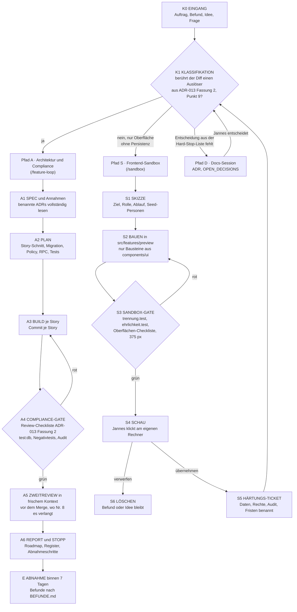

# Graph-Engineering-Workflow

Stand 2026-09-13 · Version 1.0 · **in Kraft** seit der Freigabe durch Jannes
am 2026-09-13 · gilt für jede Session, die Code oder Steuerungsdokumente
dieses Repositories ändert

## Was dieses Dokument ist und was nicht

Es beschreibt, **welchen Weg ein Auftrag durch das Repository nimmt**: einen
Graphen mit einem deterministischen Klassifikationsknoten und drei Pfaden mit
unterschiedlichen Gates. Der Feature-Loop (`.claude/skills/feature-loop/SKILL.md`)
ist der Pfad A dieses Graphen; der Sandbox-Skill (`.claude/skills/sandbox/SKILL.md`)
ist der Pfad S. Die inhaltlichen Regeln stehen weiterhin in `CLAUDE.md`,
`PROJECT_PRINCIPLES.md` und den ADRs — hier steht nur, wann welche greifen.

Es hat **keinen Rang** in der Dokumentenhierarchie und entscheidet nichts
Fachliches. Die Auslöser für Pfad A und die zehn Punkte der Review-Checkliste
stehen **einmal**, in ADR-013 Fassung 2 (Punkt 9); dieses Dokument sagt, an
welchem Knoten sie greifen. Die Reihenfolge der Loops steht allein in
[`ROADMAP.md`](ROADMAP.md).

**Wortwahl.** Die Roadmap kennt „Spuren" (A1 bis A3 zum Bauen, B zum
Entscheiden). Die Wege dieses Graphen heißen deshalb **Pfade** — Pfad A, S
und D —, damit „Spur B" nicht zwei Dinge meint.

## Warum ein Graph statt einer Kette

Der Loop Spec → Inspect → Plan → Build → Verify → Review → Fix → Final Verify
→ Report ist als Kette gut, hatte aber drei blinde Stellen (Befund der
Docs-Session vom 2026-09-13):

1. Jede Änderung lief durch dieselben Gates, ob sie eine RLS-Policy oder eine
   Schaltflächenbeschriftung änderte. Die Unterscheidung steckte nur in
   Skill-Schritt C („Plan nur bei Datenmodell/RLS"), in der Check-Tabelle und
   in der Modellwahl der Roadmap.
2. Die Review-Checkliste für kritische Änderungen, die ADR-013 Punkt 8 seit
   dem 2026-08-28 verlangt, existierte nicht; die Oberflächen-Checkliste wurde
   dafür gehalten.
3. Freies Prototyping war technisch möglich (`src/features/preview/`,
   `VorschauProvider`, `demodaten`, Quelltext-Gate `trennung.test.ts`), aber
   regelseitig verboten („keine neue Vorschau"). UX-Aufträge liefen deshalb als
   „eigener Auftrag, nicht aus der Roadmap" durch den vollen Loop.

Der Graph macht die Unterscheidung zu einem eigenen Knoten, gibt dem Pfad A
ein benanntes Compliance-Gate und der Oberfläche einen technisch
abgesicherten, zeitlich begrenzten Sandkasten.

## Der Graph

## K1 — Klassifikation

Deterministisch, keine Ermessensfrage. Jede Session prüft sie **vor** dem
ersten Schritt ihres Skills und nennt das Ergebnis in einem Satz.

**Pfad A**, sobald der **Diff der Session** mindestens einen Auslöser aus
ADR-013 Fassung 2, Punkt 9 berührt (die Liste steht nur dort: Migration,
Policy, RPC, Auth, Audit, Retention, Rechnung, Außenverbindung,
personenbezogene Daten — Wortlaut im ADR) **oder** einen Pfad-S-Prototyp in
eine echte Funktion überführt (S5 → K1). Maßgeblich ist, was die Session
ändert — nicht, was die echte Funktion später einmal bräuchte. Synthetische
Anzeigedaten in einem Prototyp sind kein personenbezogenes Feld.

**Pfad S**, nur wenn **nichts** davon berührt ist **und** kein Wert die
Sitzung überlebt: keine Persistenz, kein Netz, kein Server, kein Versandweg.
Das ist keine Einschätzung, sondern wird für den Quelltext des Prototyps durch
`src/features/preview/trennung.test.ts` erzwungen (S3) — einschließlich der
Importe aus echten API-Modulen, die dort nur als reine Hilfsfunktionen
erlaubt sind. Ein Thema, das die Roadmap zurückgestellt hat (Stufe 2,
`zurückgestellt`), darf trotzdem prototypisiert werden — der Prototyp
entscheidet nichts; S1 nennt die Zurückstellung.

**Pfad D**, wenn dem Auftrag erst eine Entscheidung fehlt, die keine Annahme
sein darf — die abschließende Hard-Stop-Liste in `PROJECT_PRINCIPLES.md`
§15.1 (Kurzfassung in `CLAUDE.md`, „Was bleibt ein Stopp"). Heute entdeckte
der Loop das erst in Schritt G; K1 zieht es vor den ersten Schritt.

Ein **Befund** aus [`BEFUNDE.md`](BEFUNDE.md) läuft als Einzel-Story-Loop
durch K1 wie jeder Auftrag. Ein Auftrag, der Pfad A und Pfad S mischen
würde, ist Pfad A — die Oberfläche entsteht dort im vertikalen Schnitt.

Die Kartenprototypen MAP-002 bis MAP-005 (`MAP-LOOPS.md`) sind **keine**
Sandbox-Prototypen: Sie berühren einen externen Datenfluss (ADR-019) und
laufen als Pfad A mit Vorschau-Kennzeichnung, so wie die Roadmap sie führt.

## Pfad A — Architektur und Compliance

Das ist der Feature-Loop, mit zwei Verschärfungen, die vorher nur implizit
galten:

1. **A4, das Compliance-Gate.** Ein Pfad-A-Auftrag enthält per Definition
   kritische Änderungen (ADR-013 Fassung 2, Punkt 9 — derselbe Auslöser wie
   K1). Skill-Schritt F arbeitet die **Review-Checkliste** aus demselben
   Punkt je Story ab; der Bericht (Schritt I) nennt das Ergebnis je Punkt,
   nicht zutreffende Punkte als „entfällt" mit Begründung. Ein roter Punkt
   geht zurück nach A3, nie in den Bericht als „bekannte Einschränkung". Die
   Oberflächen-Checkliste aus `docs/abnahme/README.md` bleibt daneben
   bestehen; sie prüft etwas anderes.
2. **A5, der Zweitreview.** Wo Nr. 8 der Checkliste es verlangt (Policy,
   `SECURITY DEFINER`, Datenumzug, Rechnungsausstellung, Nummernkreis,
   Löschung), wird der Diff **vor dem Merge in frischem Kontext** gelesen:
   in derselben Session durch einen Review-Subagenten mit eigenem Kontext,
   der nur den Diff und die Checkliste als Auftrag bekommt (neben der breiten
   Suche die zweite zulässige Ausnahme von Credit-Regel 8). Ist das nicht
   möglich, nennt der Bericht den Zweitreview als ausstehend, der Pull
   Request bleibt ohne Auto-Merge, und Jannes startet die Zeile
   „Zweitreview" aus „Sessions starten" (Opus 5 `xhigh`). Befunde aus A5
   werden ein Einzel-Story-Loop, wie es CAL-016 vorgemacht hat.

Pfad A liest die im SPEC benannten ADRs vollständig; Modell und
Aufwandsstufe kommen aus der Modelltabelle der Roadmap.

## Pfad S — Frontend-Sandbox

Neu seit dem 2026-09-13. Aufrufe: `/sandbox <Thema>` (S1 bis S4),
`/sandbox <Thema> übernehmen` (S5), `/sandbox <Thema> verwerfen` (S6);
Modell Sonnet 5 `medium`. Der Sandkasten ersetzt die frühere Regel „keine
neue Vorschau" durch eine **zeitlich begrenzte, technisch abgesicherte
Erlaubnis**.

**Ort und Schutz.** Ein Prototyp liegt unter `src/features/preview/<thema>/`
und ist damit von `trennung.test.ts` automatisch erfasst (nur ein Ort
außerhalb müsste dort in `VORSCHAUBEREICHE` stehen). Er nutzt
`VorschauProvider`, darf `Vorschauzustand` um ein eigenes Feld `<thema>`
erweitern und eigene synthetische Personen im Muster von `demodaten` anlegen
(erfundene Namen, `@praxis.invalid`); „bestehender Vorschaubereich" meint die
Routen in `ARBEITSBEREICHE.md` §2, nicht das Gerüst. Jede Seite trägt den
Hinweis „noch keine echte Speicherung". Damit ist **erzwungen**, nicht
vereinbart, dass kein Server, kein Netz, keine Persistenz und kein Versandweg
berührt wird — auch nicht über einen Import aus `src/features/*/api.ts`.
Keine neue Abhängigkeit, keine Migration, keine Änderung an Rollen, Audit
oder RLS.

**Was gelesen wird.** [`ARBEITSBEREICHE.md`](ARBEITSBEREICHE.md), die
Oberflächen-Checkliste aus `docs/abnahme/README.md`, die **eine** passende
Ideen-Datei aus `docs/product/ideen/`. Keine ADR-Lektüre außer ADR-015
(Stack) und ADR-011 (keine Namen in Adressen und Logs).

**Was herauskommt.**

- eine Route unter `/vorschau/<thema>`, erreichbar über „Alle Bereiche"
  (`BereichePage`), in der Navigation höchstens mit `vorschau: true`
- je simulierter Aktion ein Test in `src/features/preview/<thema>/ehrlichkeit.test.tsx`,
  der prüft, dass die Meldung sagt, was **nicht** passiert ist — nach dem
  Muster von `src/features/preview/ehrlichkeit.test.tsx`
- Bildschirmfotos bei 375 und 1280 px, wo der lokale Stack läuft; in der
  Cloud-Umgebung stattdessen die Prüfung im Komponententest, und Jannes macht
  die Bilder bei der Schau (`docs/abnahme/README.md`, Punkt 1)
- ein Eintrag in `ARBEITSBEREICHE.md` §2 unter „Sandbox-Prototypen" mit
  Anlagedatum und dem Loop, der ihn ersetzen soll
- ein Eintrag in `BEFUNDE.md` oder im Ideenspeicher, je nachdem, ob der
  Prototyp Gebautes korrigiert oder Fehlendes zeigt
- auf „übernehmen" ein **Härtungs-Ticket** (S5) als
  `docs/development/sandbox/<thema>.md`: welche Daten, Rechte,
  Auditereignisse, Datenklassen und Fristen die echte Funktion bräuchte. Das
  Ticket ist die SPEC-Eingabe für Pfad A — und nichts weiter: Es entscheidet
  nichts und importiert keinen Scope.

**Lebensdauer.** Ein Prototyp lebt höchstens **zwei Code-Loops** lang,
gezählt in der Fortschrittstabelle der Roadmap ab seinem Commit. Dann wird er
in Pfad A **ersetzt** (nicht daneben gebaut — die bestehende Regel bleibt)
oder gelöscht (S6). Das Wochenupdate meldet abgelaufene Prototypen
(Roadmap, „Wochenupdate", Schritt 6); ausgetragen werden sie über
`/sandbox <Thema> verwerfen` oder als erste Story des ersetzenden Loops.

**Was Pfad S nie darf.**

- Sichtbarkeit zwischen Rollen verschieben oder eine Rollenprüfung nachbilden,
  die es serverseitig nicht gibt
- echte Daten zeigen oder erfundene Daten, die als echt gelesen werden könnten
- einen Erfolg behaupten, den es nicht gibt — je Prototyp geprüft in dessen
  `ehrlichkeit.test.tsx`
- als Argument für Scope dienen — ein Prototyp ist Rang 6 mit Bildern
- die bestehenden Vorschaubereiche aus `ARBEITSBEREICHE.md` §2 erweitern;
  die bleiben eingefroren, bis ihr Loop sie ersetzt

## Pfad D — Docs-Session

Unverändert: ADR schreiben, Providerprüfung, Entscheidungen von Jannes
eintragen, Planungssession (Aufrufe in der Roadmap, „Sessions starten"). Neu
ist nur, dass K1 den Pfad **erzwingt**, wenn ein Auftrag in die
Hard-Stop-Liste fällt: Die Session stellt die Frage mit Optionen, Empfehlung
und Konsequenzen und baut vorher alles, was nicht davon abhängt (§15.1).

## Gemeinsame Knoten

- **E — Abnahme.** Merge, sobald die CI grün ist (Auto-Merge erlaubt; bei
  ausstehendem Zweitreview A5 wartet der Pull Request darauf); Abnahme durch
  Jannes binnen sieben Tagen nach `docs/abnahme/`; Befunde nach `BEFUNDE.md`
  und als erste Story in den nächsten Loop derselben Spur (R6).
- **Register.** `OPEN_DECISIONS.md` (ohne Rang), `ASSUMPTIONS.md` (jede
  Annahme mit Code-Anker `ANN-NNN`), Ideenspeicher (Herkunft, nie Scope) —
  gelten für alle Pfade. Pfad S trifft keine Annahmen; was dort nach einer
  Annahme aussieht, gehört ins Härtungs-Ticket.
- **Verifikation.** Keine Prüfung wird als gelaufen gemeldet, die nicht
  gelaufen ist — auf jedem Pfad.

## Bekannte Grenzen

- Der Klassifikator ist eine Liste, kein Werkzeug. Ein Hook, der die Pfade im
  Diff gegen die Liste prüft und den Pfad ausgibt, wäre der nächste Schritt und
  ein kleiner Bauauftrag (Ideenspeicher, nicht Roadmap).
- Die Sandbox ersetzt keine Ablaufrunde: Sie zeigt, wie etwas aussehen könnte,
  misst aber nichts (`OPTIMIERUNG.md`, eingefroren bis Probewoche 1).
- E15 verschiebt die Grenze, an der A4 die Projektionen prüft: Was `office`
  sehen darf, ist ab ROL-EPIC-001 fast alles; die Auditpflicht bleibt.

## Verankerung

| Datei | Was dort steht |
| --- | --- |
| `CLAUDE.md`, „Arbeitsweise" | K1 vor jedem Auftrag; Pfad S als erlaubter Weg |
| `.claude/skills/feature-loop/SKILL.md` | Schritt K1 vor A; Schritt F arbeitet die Review-Checkliste ab (A4) und führt den Zweitreview, wo Nr. 8 ihn verlangt (A5) |
| `.claude/skills/sandbox/SKILL.md` | Pfad S, Schritte S1 bis S6 |
| [`docs/adr/ADR-013-ci-cd-and-release-governance.md`](../adr/ADR-013-ci-cd-and-release-governance.md), Fassung 2 | Auslöser für „kritische Änderung" und die zehn Punkte der Review-Checkliste |
| `src/features/preview/trennung.test.ts` | Quelltext-Gate der Sandbox, einschließlich der Import-Regel für echte API-Module |
| `ARBEITSBEREICHE.md` §2 und §6 | Sandbox-Prototypen mit Ablauf; Vorschau-Regeln |
| `ROADMAP.md`, „Sessions starten", Credit-Regeln 4, 8 und 12, Modelltabelle, „Wochenupdate" | Zeilen „Sandbox" und „Zweitreview"; Review-Subagent als zweite Ausnahme; Schritt 6 meldet abgelaufene Prototypen |
| `DEVELOPMENT_WORKFLOW.md` | Absicht hinter den Pfaden; wer welches Steuerungsdokument ändert |

## Änderungsvermerk

| Version | Datum | Änderung |
| --- | --- | --- |
| 1.0 | 2026-09-13 | Erste Fassung aus der Docs-Session „Dokumentations-Audit" (Knoten 4), freigegeben von Jannes am selben Tag. Abweichungen vom freigegebenen Konzept, jeweils berichtet: Pfade statt Spuren benannt; die Auslöserliste steht nur in ADR-013; der Zweitreview läuft vor dem Merge, in derselben Session als Review-Subagent oder als eigene Session, auf die der Pull Request wartet; Modellwahl bleibt bei der Modelltabelle der Roadmap. |
