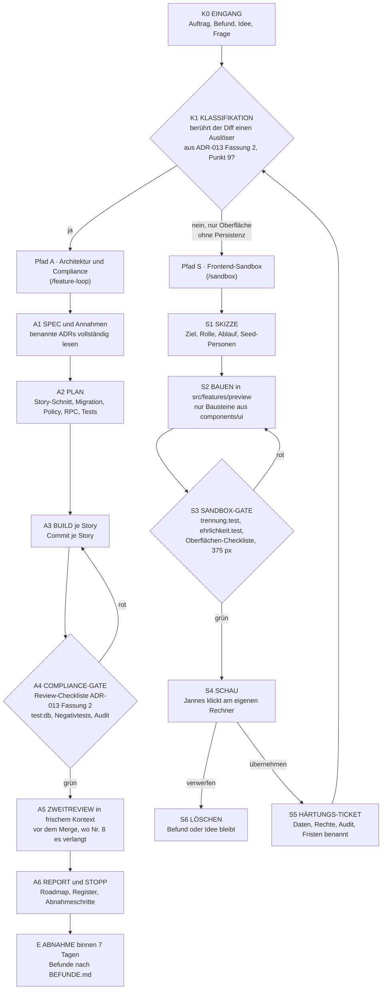

# Graph-Engineering-Workflow

Stand 2026-09-14 · Version 1.1 · **in Kraft** seit der Freigabe durch Jannes
am 2026-09-13 · gilt für jede Session, die Code oder Steuerungsdokumente
dieses Repositories ändert

## Was dieses Dokument ist und was nicht

Es beschreibt, **welchen Weg ein Auftrag durch das Repository nimmt**: einen
Graphen mit einem deterministischen Klassifikationsknoten und zwei Pfaden mit
unterschiedlichen Gates. Der Feature-Loop (`.claude/skills/feature-loop/SKILL.md`)
ist der Pfad A dieses Graphen; der Sandbox-Skill (`.claude/skills/sandbox/SKILL.md`)
ist der Pfad S und trägt dessen Regeln. Hier stehen die Knoten, wann sie
greifen und wer welches Steuerungsdokument ändert.

Es hat **keinen Rang** in der Dokumentenhierarchie und entscheidet nichts
Fachliches. Die Auslöser für Pfad A und die zehn Punkte der Review-Checkliste
stehen **einmal**, in ADR-013 Fassung 2 (Punkt 9). Die Reihenfolge der Loops
steht allein in [`ROADMAP.md`](ROADMAP.md).

**Wortwahl.** Die Roadmap kennt „Spuren" (A1 bis A3 zum Bauen, B zum
Entscheiden). Die Wege dieses Graphen heißen deshalb **Pfade** — Pfad A und
S —, damit „Spur" nicht zwei Dinge meint.

## Warum ein Graph statt einer Kette

Der Loop Spec → Inspect → Plan → Build → Verify → Review → Fix → Final Verify
→ Report ist als Kette gut, hatte aber drei blinde Stellen (Befund der
Docs-Session vom 2026-09-13):

1. Jede Änderung lief durch dieselben Gates, ob sie eine RLS-Policy oder eine
   Schaltflächenbeschriftung änderte.
2. Die Review-Checkliste für kritische Änderungen, die ADR-013 Punkt 8 seit
   dem 2026-08-28 verlangt, existierte nicht.
3. Freies Prototyping war technisch möglich (`src/features/preview/`,
   Quelltext-Gate `trennung.test.ts`), aber regelseitig verboten.

Der Graph macht die Unterscheidung zu einem eigenen Knoten, gibt dem Pfad A
ein benanntes Compliance-Gate und der Oberfläche einen technisch
abgesicherten, zeitlich begrenzten Sandkasten.

## Der Graph

## K1 — Klassifikation

Deterministisch, keine Ermessensfrage. Jede Session prüft sie **vor** dem
ersten Schritt ihres Skills und nennt das Ergebnis in einem Satz.

**Pfad A**, sobald der **Diff der Session** mindestens einen Auslöser aus
ADR-013 Fassung 2, Punkt 9 berührt (die Liste steht nur dort: Migration,
Policy, RPC, Auth, Audit, Retention, Rechnung, Außenverbindung,
personenbezogene Daten — Wortlaut im ADR) **oder** einen Pfad-S-Prototyp in
eine echte Funktion überführt (S5 → K1). Maßgeblich ist, was die Session
ändert — nicht, was die echte Funktion später einmal bräuchte. Synthetische
Anzeigedaten in einem Prototyp sind kein personenbezogenes Feld.

**Pfad S**, nur wenn **nichts** davon berührt ist **und** kein Wert die
Sitzung überlebt: keine Persistenz, kein Netz, kein Server, kein Versandweg.
Das ist keine Einschätzung, sondern wird für den Quelltext des Prototyps durch
`src/features/preview/trennung.test.ts` erzwungen (S3). Ein Thema, das die
Roadmap zurückgestellt hat, darf trotzdem prototypisiert werden — der
Prototyp entscheidet nichts; S1 nennt die Zurückstellung.

**Fehlt eine Entscheidung aus der Hard-Stop-Liste** (`PROJECT_PRINCIPLES.md`
§15.1; `CLAUDE.md`, „Was bleibt ein Stopp"): die Frage mit Optionen,
Empfehlung und Konsequenzen stellen und alles bauen, was nicht davon abhängt.
Docs-Sessions sind Aufgaben wie jede andere und laufen ohne eigenen Pfad.

Ein **Befund** aus [`BEFUNDE.md`](BEFUNDE.md) läuft als Einzel-Story-Loop
durch K1 wie jeder Auftrag. Ein Auftrag, der Pfad A und Pfad S mischen
würde, ist Pfad A — die Oberfläche entsteht dort im vertikalen Schnitt.

Die Kartenprototypen MAP-002 bis MAP-005 (`MAP-LOOPS.md`) sind **keine**
Sandbox-Prototypen: Sie berühren einen externen Datenfluss (ADR-019) und
laufen als Pfad A mit Vorschau-Kennzeichnung, so wie die Roadmap sie führt.

## Pfad A — Architektur und Compliance

Das ist der Feature-Loop mit zwei benannten Gates:

1. **A4, das Compliance-Gate.** Skill-Schritt F arbeitet die
   Review-Checkliste aus ADR-013 Fassung 2, Punkt 9 je Story ab; ein roter
   Punkt geht zurück nach A3, nie als „bekannte Einschränkung" in den
   Bericht. Die Oberflächen-Checkliste aus `docs/abnahme/README.md` prüft
   daneben etwas anderes.
2. **A5, der Zweitreview** — Pflicht und Auslöser nach ADR-013 Fassung 2,
   Punkt 9, Nr. 8; Ablauf im Feature-Loop-Skill, Schritt F.

Pfad A liest die im SPEC benannten ADRs vollständig.

## Pfad S — Frontend-Sandbox

Aufrufe und Regeln stehen im Sandbox-Skill; hier nur die Knoten und Grenzen.

**Knoten.** S1 Skizze · S2 Bauen unter `src/features/preview/<thema>/` · S3
Sandbox-Gate · S4 Schau durch Jannes · S5 Härtungs-Ticket auf „übernehmen"
(SPEC-Eingabe für Pfad A, entscheidet nichts) · S6 Löschen auf „verwerfen".

**Lebensdauer.** Ein Prototyp lebt höchstens **zwei Code-Loops** lang,
gezählt in der Fortschrittstabelle der Roadmap ab seinem Commit. Dann wird er
in Pfad A **ersetzt** (nicht daneben gebaut) oder gelöscht (S6). Das
Wochenupdate meldet abgelaufene Prototypen (Roadmap, „Wochenupdate",
Schritt 6).

**Was Pfad S nie darf.**

- Sichtbarkeit zwischen Rollen verschieben oder eine Rollenprüfung nachbilden,
  die es serverseitig nicht gibt
- echte Daten zeigen oder erfundene Daten, die als echt gelesen werden könnten
- einen Erfolg behaupten, den es nicht gibt — je Prototyp geprüft in dessen
  `ehrlichkeit.test.tsx`
- als Argument für Scope dienen — ein Prototyp ist Rang 6 mit Bildern
- die bestehenden Vorschaubereiche aus `ARBEITSBEREICHE.md` §2 erweitern;
  die bleiben eingefroren, bis ihr Loop sie ersetzt

## Gemeinsame Knoten

- **E — Abnahme.** Merge nach der Definition of Done der Roadmap; Abnahme
  durch Jannes binnen sieben Tagen nach `docs/abnahme/`; Befunde nach
  `BEFUNDE.md` und als erste Story in den nächsten Loop derselben Spur (R6).
- **Register.** `OPEN_DECISIONS.md` (ohne Rang), `ASSUMPTIONS.md` (jede
  Annahme mit Code-Anker `ANN-NNN`), Ideenspeicher (Herkunft, nie Scope) —
  gelten für beide Pfade. Pfad S trifft keine Annahmen; was dort nach einer
  Annahme aussieht, gehört ins Härtungs-Ticket.

## Bekannte Grenzen

- Der Klassifikator ist eine Liste, kein Werkzeug. Ein Hook, der die Pfade im
  Diff gegen die Liste prüft und den Pfad ausgibt, wäre der nächste Schritt und
  ein kleiner Bauauftrag (Ideenspeicher, nicht Roadmap).
- Die Sandbox ersetzt keine Ablaufrunde: Sie zeigt, wie etwas aussehen könnte,
  misst aber nichts (`OPTIMIERUNG.md`).
- E15 verschiebt die Grenze, an der A4 die Projektionen prüft: Was `office`
  sehen darf, ist ab ROL-EPIC-001 fast alles; die Auditpflicht bleibt.

## Verankerung

| Datei | Was dort steht |
| --- | --- |
| `CLAUDE.md`, „Arbeitsweise" | K1 vor jedem Auftrag; beide Aufrufe |
| `.claude/skills/feature-loop/SKILL.md` | Schritt K1 vor A; Zuschnitt eines Loops; Schritt F arbeitet die Review-Checkliste ab (A4) und führt den Zweitreview (A5) |
| `.claude/skills/sandbox/SKILL.md` | Pfad S, Schritte S1 bis S6 samt Regeln |
| [`docs/adr/ADR-013-ci-cd-and-release-governance.md`](../adr/ADR-013-ci-cd-and-release-governance.md), Fassung 2 | Auslöser für „kritische Änderung" und die zehn Punkte der Review-Checkliste |
| `src/features/preview/trennung.test.ts` | Quelltext-Gate der Sandbox, einschließlich der Import-Regel für echte API-Module |
| `ARBEITSBEREICHE.md` §2 und §6 | Sandbox-Prototypen mit Ablauf; Vorschau-Regeln |
| `ROADMAP.md`, „Sessions starten", „Definition of Done", Credit-Regeln 4, 8 und 12, „Wochenupdate" | Zeilen „Sandbox" und „Zweitreview"; Merge; Review-Subagent als zweite Ausnahme; Schritt 6 meldet abgelaufene Prototypen |

### Wer ändert welches Steuerungsdokument

| Dokument | Loop (`/feature-loop`, Pfad A) | Sandbox (`/sandbox`, Pfad S) | Docs- oder Planungssession | Ablaufrunde | Wochenupdate |
| --- | --- | --- | --- | --- | --- |
| `ROADMAP.md` | Fortschrittstabelle, „Nächster Loop", `fortschritt.json` (Schritt I) | — | nachstellen, neue Zeilen als Vorschlag | nur als Diff, den Jannes freigibt | liest nur |
| `ARBEITSBEREICHE.md` | ersetzte Vorschau austragen | Prototyp eintragen (S4) und austragen (S6) | Stand nachführen | — | abgelaufene Prototypen melden (Schritt 6) |
| `OPEN_DECISIONS.md` | Verweis auf neue `ANN`-Kennungen | — | Entscheidungen von Jannes eintragen | — | liest nur |
| `ASSUMPTIONS.md` | neue Annahmen sofort (Schritt D) | keine — was nach einer Annahme aussieht, kommt ins Härtungs-Ticket | Bestätigungen | — | — |
| `BEFUNDE.md` | bearbeitete Befunde als erledigt | Befund aus der Schau | neue Befunde aus Abnahmen und Reviews | Bruchstellen als Befunde | — |
| Ideenspeicher | neue Ideen als `vorschlag` | Idee aus der Schau als `vorschlag` | Ideen von Jannes als `notiert` | Ziel 3 („Idee") | — |
| Prinzipien, ADRs | nie ohne Auftrag (§21) | nie | auf Auftrag, eigener Commit | nie | nie |

## Änderungsvermerk

| Version | Datum | Änderung |
| --- | --- | --- |
| 1.1 | 2026-09-14 | Konsolidierung R2: Pfad D entfällt (K1 hat zwei Ausgänge und den §15.1-Satz); Pfad-S-Regeln stehen nur noch im Sandbox-Skill; der Zweitreview verweist auf ADR-013 und den Skill; die Tabelle „Wer ändert welches Steuerungsdokument" kommt aus dem gelöschten `DEVELOPMENT_WORKFLOW.md` hierher; Modellwahl nicht mehr über die Roadmap. |
| 1.0 | 2026-09-13 | Erste Fassung aus der Docs-Session „Dokumentations-Audit" (Knoten 4), freigegeben von Jannes am selben Tag. |
